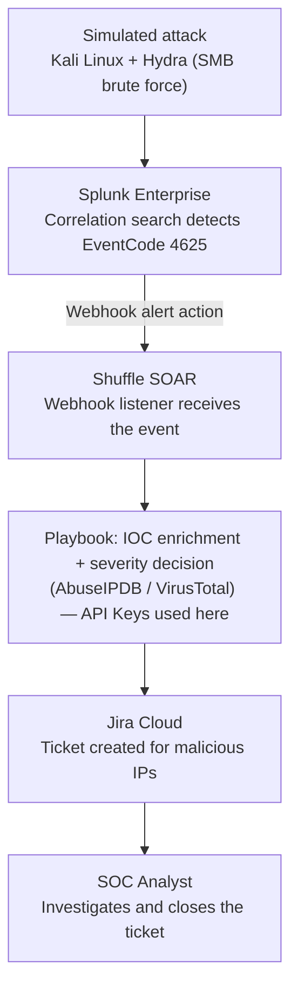

# SOC Automation Setup — SIEM-to-SOAR Detection Pipeline

**Splunk (SIEM) → Shuffle (SOAR) → Jira (Ticketing)**

> A hands-on build documenting how a brute-force detection in a SIEM can be look like.

**Status:** Detection logic fully built and verified against live attack
traffic. SOAR webhook listener live. Jira ticketing demonstrated manually.
Automated enrichment + auto-ticketing (the full playbook) is Phase 2

---

## Why this project

Most beginner SOC portfolio projects stop at "I built a Splunk dashboard."
This project goes one step further: it attempts to demonstrate the actual
mechanism that makes a SOC *automated* — a detection that hands itself off
to an orchestration layer without a human manually copying data between
tools. The goal was to build that handoff, document what broke, and fix it
the way it's actually fixed in a real environment: by reading raw data,
not assuming defaults.

## Architecture



## Tech stack Used:

| Layer | Tool | Tier used |
|---|---|---|
| SIEM | Splunk Enterprise | Free (single-instance) |
| Attack simulation | Kali Linux + Hydra | Free |
| Target | Windows 11 (host machine) | Local lab |
| SOAR | Shuffle | Free cloud tier |
| Ticketing | Jira Cloud | Free tier |
| Threat intel (Phase 2) | AbuseIPDB, VirusTotal | Free tier APIs |

## What's built and verified

### 1. Attack simulation
A brute-force attack against SMB (port 445) was run from Kali using Hydra
against a Windows 11 target, generating genuine failed-logon attempts.


### 2. Detection — raw event verification
Before writing detection logic, the raw Windows Security event was
inspected directly rather than assuming standard field names. This is
where it became clear that without the official Splunk Add-on for
Windows installed, the attacker's address is extracted as
`Source_Network_Address`, not the commonly-assumed `src_ip` — and the
account field is `Account_Name`, not `user`.


### 3. Detection — correlation search
A correlation search was built using the real field names, bucketing
events into 5-minute windows and flagging any source address with 5 or
more failed attempts:

```spl
index=main EventCode=4625
| bucket _time span=5m
| stats count as failed_attempts values(Account_Name) as targeted_accounts by _time, Source_Network_Address
| where failed_attempts >= 5
| sort - failed_attempts
```

This was converted into a scheduled Splunk alert with a **Webhook** alert
action, after configuring Splunk's webhook allow-list (required since
Splunk Enterprise 9.0) directly via `alert_actions.conf`:

```ini
[webhook]
allowlist.webhook1 = ^https:\/\/shuffler\.io\/api\/v1\/hooks\/
enable_allowlist = true
```

### 4. SOAR layer — Shuffle
Splunk's own SOAR product turned out not to have a genuine self-serve free
cloud trial (only a self-hosted Community edition, requiring a VM install,
or a sales-quoted Cloud subscription). [Shuffle](https://shuffler.io) — an
open-source SOAR platform with a real free cloud tier — was used instead.
A webhook trigger was configured and activated to receive Splunk's alert
payload.


Shuffle's app library was also reviewed for the Phase 2 build —
pre-built apps for Jira, AbuseIPDB, and VirusTotal integrations:

### 5. Ticketing — Jira
A Jira Cloud project (`SOC Automation Lab`) was created to represent the
analyst-facing side of the pipeline.


A ticket was created manually, modeling the exact incident the detection
logic above would escalate, confirming what the automated hand-off (built
in Phase 2) is meant to produce:


## Engineering challenges encountered

This section exists on purpose. Real infrastructure work looks like this
and being able to diagnose and fix it is the actual skill being
demonstrated.

| Problem | Root cause | Fix |
|---|---|---|
| Splunk's "Local Event Log Collection" Edit page returned 404 | Confirmed bug in Splunk Enterprise 10.x on Windows | Configured the input directly via `inputs.conf` instead of the GUI |
| `src_ip` / `user` fields came back empty in searches | No Splunk Add-on for Windows installed — fields extract under different names | Inspected a raw event, found the real field names (`Source_Network_Address`, `Account_Name`), rebuilt the search around them |
| Webhook alert silently never reached Shuffle | Splunk Enterprise 9.0+ requires explicit webhook allow-listing — no GUI page for this outside Splunk Cloud | Added the allow-list entry via `alert_actions.conf` |
| Splunk SOAR had no genuine free cloud trial | "Free trial" page only offers self-hosted Community edition or a sales-quoted Cloud subscription | Switched to Shuffle, an open-source SOAR alternative with a real free cloud tier |
| Scheduled alert never fired | Alert type defaulted to weekly schedule instead of every few minutes; trigger frequency and time-range window were also misconfigured | Corrected to a cron schedule, "Number of Results" trigger, and a time range matched to the bucket window |

## Current status

- ✅ Attack simulation reproducible and verified
- ✅ Detection logic verified against real attack data
- ✅ Splunk webhook alert action configured and allow-listed
- ✅ Shuffle SOAR webhook listener live
- ✅ Jira ticketing structure demonstrated manually
- ⏳ Live scheduled webhook fire (Splunk → Shuffle), end-to-end and unattended
- ⏳ Automated IOC enrichment (AbuseIPDB / VirusTotal)
- ⏳ Automated Jira ticket creation from the playbook

## Roadmap / Phase 2

1. Validate the scheduled alert firing automatically into Shuffle without manual triggering
2. Build the Shuffle playbook: extract source IP → enrich via AbuseIPDB/VirusTotal → branch on severity
3. Auto-create the Jira ticket from the playbook on a confirmed-malicious branch
4. Capture MTTD/MTTR-style timing metrics across the full chain

## Skills demonstrated

- SIEM detection engineering (SPL: `stats`, threshold logic)
- Reading raw log data to verify field-level assumptions rather than trusting defaults
- Splunk administration via configuration files (`inputs.conf`, `alert_actions.conf`)
- Diagnosing and working around a confirmed vendor product bug
- SOAR platform evaluation and webhook-based event ingestion
- Ticketing workflow design (Jira project/issue structure)
- Attack simulation (Hydra / SMB brute force) in an isolated lab environment

    ├── 04-shuffle-soar-account-setup.png
    ├── 05-shuffle-usecase-templates.png
    ├── 06-jira-project-board.png
    └── 07-jira-ticket-generated-NEEDS-RETAKE.png
```
